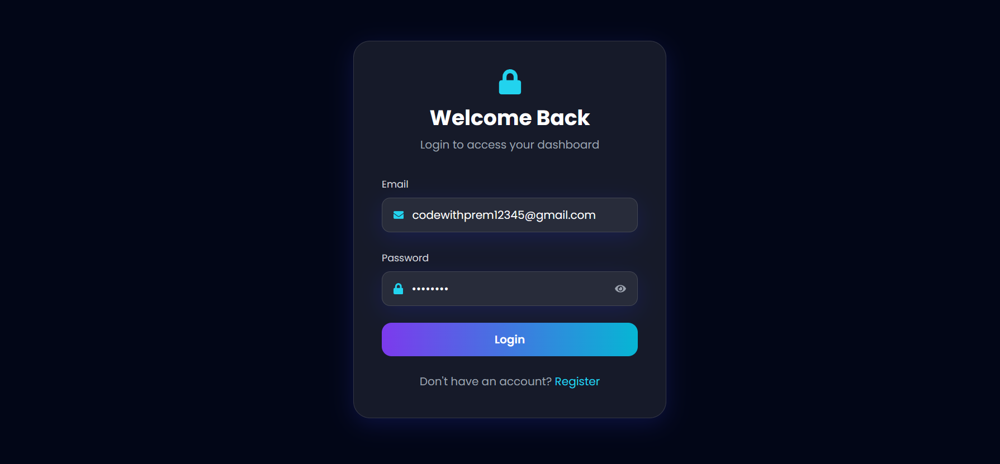
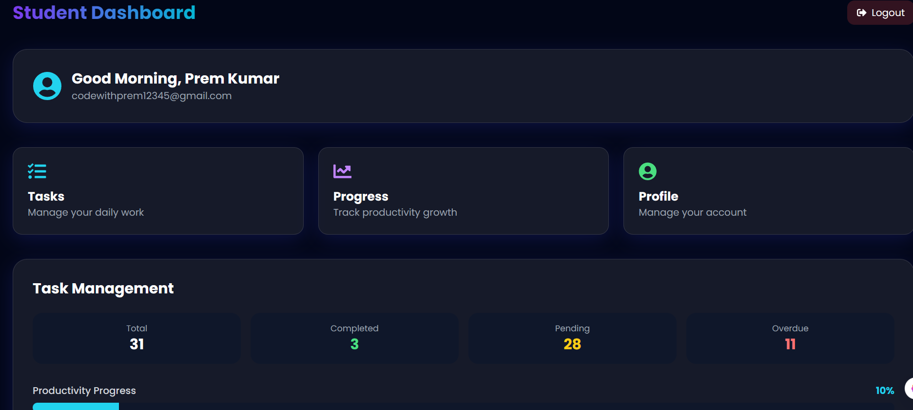

# 🚀 Student Productivity Manager

A full-stack MERN productivity web application designed to help students manage tasks, track productivity, organize priorities, and stay focused.

---

## 🌟 Live Demo

### Frontend (Vercel):
https://student-productivity-manager-jet.vercel.app

### Backend API (Render):
=https://student-productivity-manager-are7.onrender.com/api

---

## 📌 Features

### 🔐 Authentication
- User Registration
- Secure Login
- JWT Authentication
- Protected Routes

### 📋 Task Management
- Add New Tasks
- Edit Existing Tasks
- Delete Tasks
- Mark Tasks as Completed
- Persistent Task Storage (MongoDB)
- Local Backup using LocalStorage

### 🔎 Smart Productivity Tools
- Search Tasks
- Filter by:
  - All
  - Completed
  - Pending
  - Overdue
- Sort by:
  - Newest
  - Oldest
  - Priority
  - Due Date

### 📊 Productivity Dashboard
- Total Tasks Counter
- Completed Tasks Counter
- Pending Tasks Counter
- Productivity Streak
- Due Date Status
- Pagination (Show More / Show Less)

### 📤 Extra Features
- Export Tasks as JSON
- Clear Completed Tasks
- Responsive UI
- Modern Dashboard Design

---

## 🛠️ Tech Stack

### Frontend:
- React.js
- Vite
- Tailwind CSS
- Axios
- React Router DOM
- React Hot Toast

### Backend:
- Node.js
- Express.js
- MongoDB Atlas
- Mongoose
- JWT
- bcryptjs
- CORS

### Deployment:
- Vercel (Frontend)
- Render (Backend)
- GitHub (Version Control)

---

## 📂 Project Structure

```bash
student-productivity-manager/
│
├── client/                 # Frontend (React + Vite)
│   ├── src/
│   ├── public/
│   └── package.json
│
├── server/                 # Backend (Node + Express)
│   ├── controllers/
│   ├── routes/
│   ├── models/
│   ├── middleware/
│   └── server.js
│
└── README.md

# Student Productivity Manager

## ⚙️ Installation & Setup

### 1️⃣ Clone Repository

```bash
git clone https://github.com/premkumarmehta/student-productivity-manager.git
cd student-productivity-manager
```

### 2️⃣ Setup Frontend

```bash
cd client
npm install
npm run dev
```

### 3️⃣ Setup Backend

```bash
cd server
npm install
node server.js
```

---

## 🔑 Environment Variables

### Frontend (`client/.env`)

```env
VITE_API_URL=your_backend_url/api
```

### Backend (`server/.env`)

```env
PORT=5000
MONGO_URI=your_mongodb_connection_string
JWT_SECRET=your_secret_key
CLIENT_URL=your_frontend_url
```

---

## 📸 Screenshots


### Login Page




### Dashboard



---

## 🎯 Future Improvements

* 🌙 Dark / Light Theme Toggle
* 📅 Calendar View
* 🔔 Reminder Notifications
* 📂 Task Categories
* 🍅 Pomodoro Timer
* 📊 Analytics Dashboard
* 👥 Team Collaboration

---

## 👨‍💻 Author

**Prem Kumar**
🎓 MCA Student
💻 MERN Stack Developer

---

## 📬 Contact

* **GitHub:** https://github.com/premkumarmehta
* **Portfolio:** https://prem-portfolio-sable.vercel.app/

---

## ⭐ Support

If you like this project:

* ⭐ Star this repository
* 🍴 Fork this project
* 📢 Share it with others

---

## 📄 License

This project is open-source and available under the **MIT License**.
